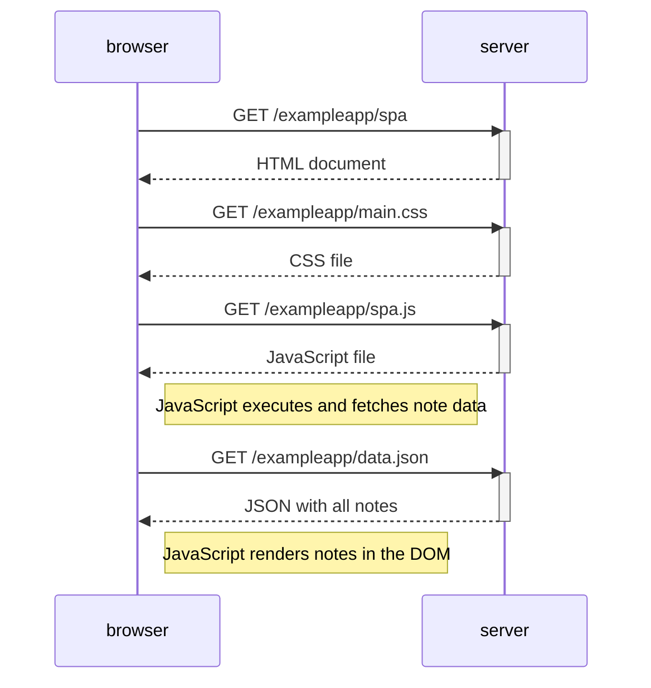

# 0.5 - SPA load diagram

```mermaid
sequenceDiagram
    participant browser
    participant server

    browser->>server: GET /exampleapp/spa
    activate server
    server-->>browser: HTML document
    deactivate server

    browser->>server: GET /exampleapp/main.css
    activate server
    server-->>browser: CSS file
    deactivate server

    browser->>server: GET /exampleapp/spa.js
    activate server
    server-->>browser: JavaScript file
    deactivate server

    Note right of browser: JavaScript executes and fetches note data

    browser->>server: GET /exampleapp/data.json
    activate server
    server-->>browser: JSON with all notes
    deactivate server

    Note right of browser: JavaScript renders notes in the DOM
```
